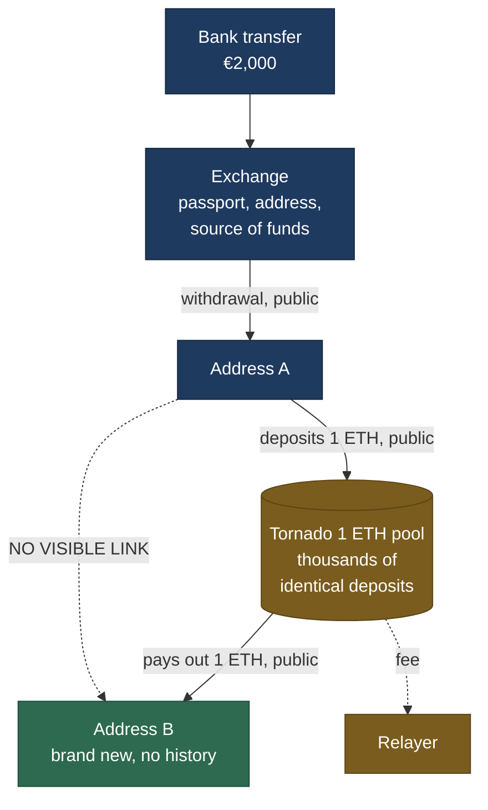
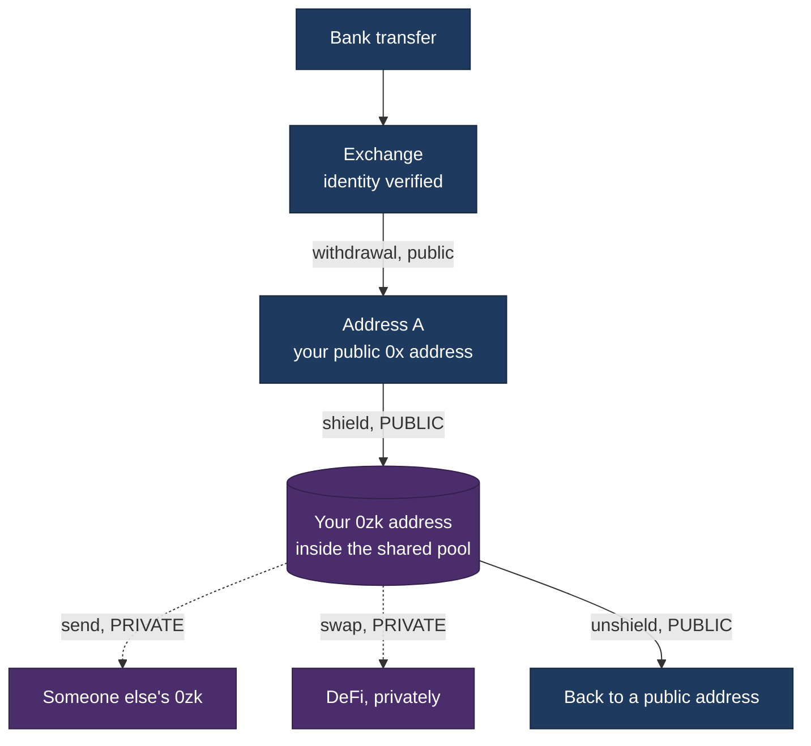
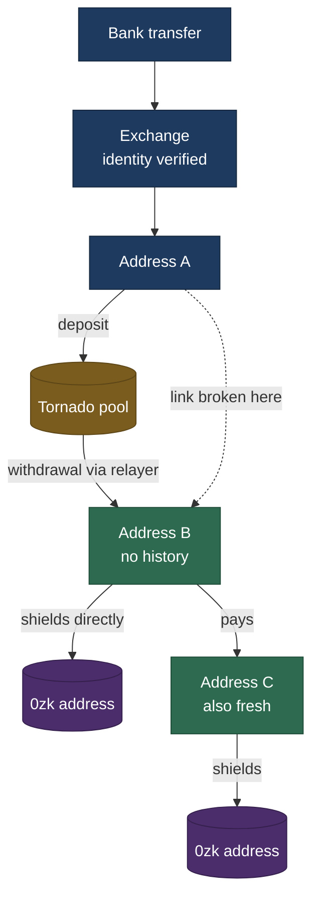
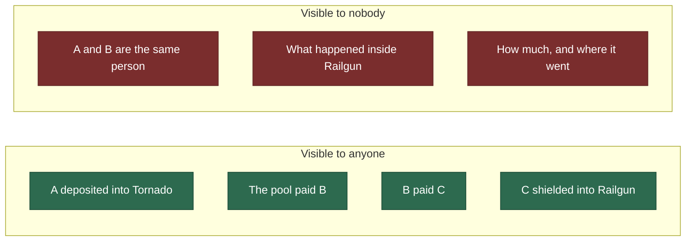

## Route 1: Fiat to Tornado Cash

### Step by step

| # | What happens | Who can see it |
|---|---|---|
| 1 | You send euros to an exchange and buy ETH | Only the exchange, your bank, and any authority that asks them |
| 2 | You withdraw the ETH to address A, a wallet you control | Everyone sees the transfer. The exchange alone knows A is yours |
| 3 | Your wallet invents a secret and computes its commitment | The secret never leaves your device |
| 4 | A sends exactly 1 ETH into the pool, publishing the commitment | Everyone sees that A deposited |
| 5 | You wait. Days, months, years | Nothing happens |
| 6 | You prove you own a valid unused deposit, without saying which | Everyone sees a proof was accepted |
| 7 | The pool pays 1 ETH to address B, and a fee to the relayer | Everyone sees both payments |

---

## Route 2: Fiat to Railgun

Railgun works differently. Nothing is mixed and nothing is withdrawn to a
fresh address. Instead you get a second, private address, and you move money
between the public one and the private one.

### Step by step

| # | What happens | Who can see it |
|---|---|---|
| 1 | Euros to exchange, buy ETH | Exchange only |
| 2 | Withdraw to address A | Everyone. Exchange knows A is yours |
| 3 | A calls `shield()`, sending tokens to the Railgun contract | **Everyone sees A shielded.** Tokens must physically leave a public address, and that cannot be hidden |
| 4 | The contract records a scrambled note in a shared tree | Everyone sees a note was added. Nobody can read it |
| 5 | You send, swap, or hold privately | Nobody. Not the amounts, not the counterparties |
| 6 | Later, you unshield back to a public address | **Everyone sees the unshield** |

### The important difference from Tornado

Tornado breaks the link between **going in and coming out**. Railgun does not
try to. It hides **everything that happens inside**.

So with Railgun, everyone can see that address A shielded. That is not a leak,
it is unavoidable. What they cannot see is the balance, what it did, or where
it went.

---

## Route 3: Fiat to Tornado to Railgun

The two combined. Tornado severs the link to your identity, Railgun hides what
happens next. There are two versions, and the difference between them is one
extra transfer.

**The upper branch** is what this research calls *depth 0*. B both withdraws
from Tornado and shields into Railgun. One address does both jobs.

**The lower branch** is *depth 1*, or one hop. B sends to a further new address
C, and C does the shielding. One extra step, one extra address.

### What each observer can see

Note what is on the left. Every individual step is public. What is missing is
only the connection across the Tornado gap, and everything after the shield.

---

## The three routes compared

| | Route 1: Tornado | Route 2: Railgun | Route 3: both |
|---|---|---|---|
| Hides who you are | yes | no | yes |
| Hides what you do afterwards | no | yes | yes |
| Publicly visible entry | deposit from A | shield from A | deposit from A |
| Publicly visible exit | payment to B | unshield | shield from B or C |
| Where the break is | between deposit and withdrawal | after the shield | both |
| Fresh addresses needed | one | none | one or two |
| What remains measurable | who deposited, who was paid | who shielded, and when | the join between them |

---

## Three honest limits

**A payment is not a person.** If address B paid address C, they may be the
same individual or two strangers. Nothing on the public ledger distinguishes
those cases, so every connection counted here is a possibility rather than a
fact.

**Not everything moves as ETH.** Stablecoins like USDC are not sent the way ETH
is. They are entries in a separate ledger kept by the token's own contract, and
they require a different collection method. Measurements limited to ETH are
floors, not totals.

**Absence of evidence.** Anyone who inserted two hops, passed through an
exchange, or used a bridge does not appear in these figures at all. A low
number is not proof that few people did something. It is proof that few people
did it in a way that leaves a visible trail.
