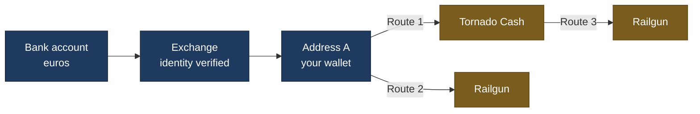
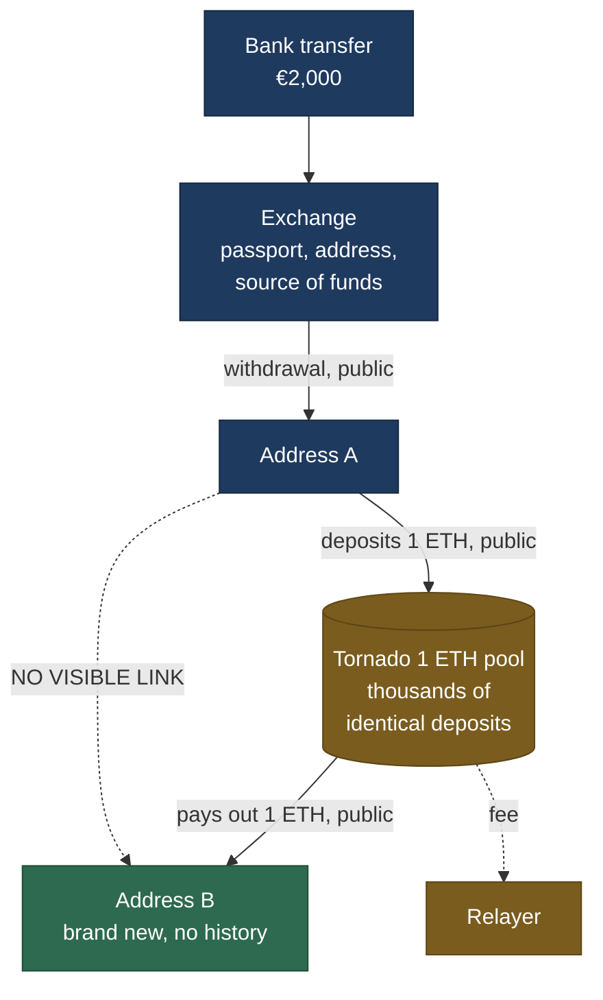
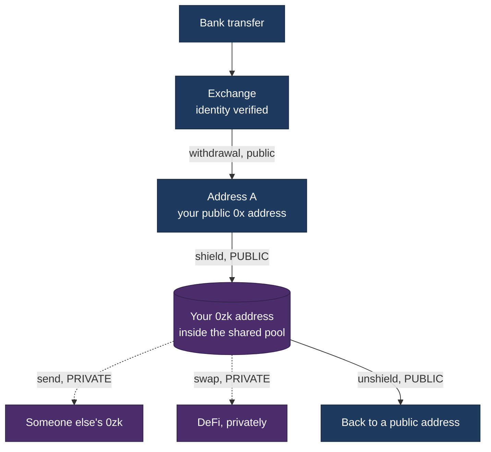
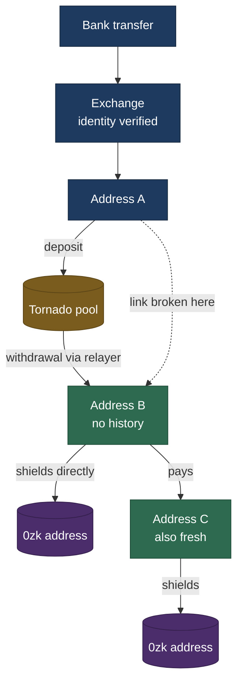
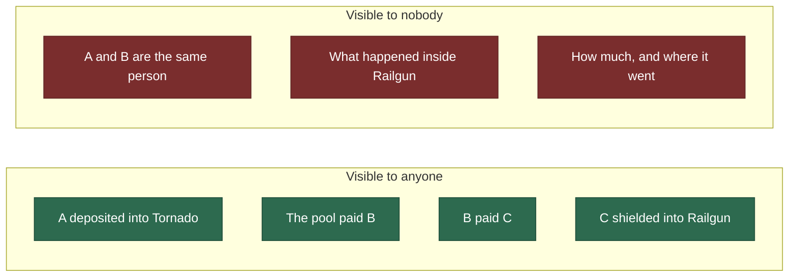

# How the money moves

Three routes, explained from the beginning. What happens at each step, what
the world can see, and where the trail goes cold.

Written for readers with no blockchain background. If you already know what a
commitment hash is, skip to the diagrams.

> Tornado Cash was designated by the US Office of Foreign Assets Control on 8
> August 2022. This document describes how the protocol works, for the purpose
> of explaining what can and cannot be measured about it from public data. It
> is documentation of an observable system, not a guide to using one.

---

## First, six words you need

**Address** — an account on Ethereum. A long string starting with `0x`.
Anyone can create one instantly, for free, and there is no limit on how many
you have. Nobody's name is attached to it.

**Public ledger** — every transaction ever made is permanently visible to
everybody. Balances, amounts, timings, all of it. Privacy on Ethereum does not
come from hiding transactions. It comes from breaking the link between them.

**Exchange** — a company like Coinbase or Binance. You send it euros, it gives
you crypto. Because it handles real money it must verify your identity, which
is called KYC, know your customer.

**Relayer** — someone who submits a transaction on your behalf and takes a fee.
Useful when your new address holds nothing and therefore cannot pay the network
fee to make its first move.

**Commitment** — a scrambled receipt. A one way maths function turns your
secret into a fixed string that cannot be turned back. Publishing the
commitment proves something exists without revealing what.

**Zero knowledge proof** — a way of proving a statement is true without
revealing why. Here it proves "I own one of the deposits in this pool" without
revealing which one.

---

## The three routes at a glance

Everything in dark blue is linked to your real identity, at least by the
exchange. Everything in gold is a privacy tool. The whole question is what
survives the crossing.

---

## Route 1: Fiat to Tornado Cash

Tornado Cash is a pool. Many people put in identical amounts, and later take
identical amounts out. Because every deposit is the same size, no amount gives
anyone away.

Think of a coat check at a large venue. You hand in your coat and everyone in
the queue sees you do it. The attendant writes no name on it, just gives you a
numbered ticket, and your coat joins hundreds of identical ones on a rail.
Later, someone presents a valid ticket and collects a coat. Nobody watching can
say which coat belonged to whom.

### Step by step

| # | What happens | Who can see it |
|---|---|---|
| 1 | You send euros to an exchange and buy ETH | Only the exchange, your bank, and any authority that asks them |
| 2 | You withdraw the ETH to address A, a wallet you control | Everyone sees the transfer. The exchange alone knows A is yours |
| 3 | Your wallet invents a secret and computes its commitment | The secret never leaves your device |
| 4 | A sends exactly 1 ETH into the pool, publishing the commitment | Everyone sees that A deposited |
| 5 | You wait. Days, months, years | Nothing happens |
| 6 | You prove you own a valid unused deposit, without saying which | Everyone sees a proof was accepted |
| 7 | The pool pays 1 ETH to address B, and a fee to the relayer | Everyone sees both payments |

### Where the trail goes cold

Between steps 4 and 6. Everyone can see that A deposited and that B was paid.
Nobody can see that they are the same person, because the only thing linking
them is the secret, which never touched the chain.

The strength of that break is the number of other deposits sitting in the pool
at the same time. If a thousand people deposited and B could be any of them,
the link is strong. If only three did, it is weak.

### What address B looks like afterwards

This is the detail that makes measurement possible at all. Address B has no
funding transaction, no prior history, and a small amount of leftover ETH the
relayer paid the network fee out of. It looks like an address that appeared
from nowhere, because it did.

---

## Route 2: Fiat to Railgun

Railgun works differently. Nothing is mixed and nothing is withdrawn to a
fresh address. Instead you get a second, private address, and you move money
between the public one and the private one.

### Step by step

| # | What happens | Who can see it |
|---|---|---|
| 1 | Euros to exchange, buy ETH | Exchange only |
| 2 | Withdraw to address A | Everyone. Exchange knows A is yours |
| 3 | A calls `shield()`, sending tokens to the Railgun contract | **Everyone sees A shielded.** Tokens must physically leave a public address, and that cannot be hidden |
| 4 | The contract records a scrambled note in a shared tree | Everyone sees a note was added. Nobody can read it |
| 5 | You send, swap, or hold privately | Nobody. Not the amounts, not the counterparties |
| 6 | Later, you unshield back to a public address | **Everyone sees the unshield** |

### Where the trail goes cold

Immediately after step 3. Shielding and unshielding are the only two Railgun
actions that reveal anything publicly. Everything in between is invisible.

There is a second layer on top. When you spend privately, the transaction is
usually submitted by a third party called a Broadcaster, so on the public
ledger it appears to come from them. Anyone in the pool could have been the
real sender.

### The important difference from Tornado

Tornado breaks the link between **going in and coming out**. Railgun does not
try to. It hides **everything that happens inside**.

So with Railgun, everyone can see that address A shielded. That is not a leak,
it is unavoidable. What they cannot see is the balance, what it did, or where
it went.

---

## Route 3: Fiat to Tornado to Railgun

The two combined. Tornado severs the link to your identity, Railgun hides what
happens next. There are two versions, and the difference between them is one
extra transfer.

**The upper branch** is what this research calls *depth 0*. B both withdraws
from Tornado and shields into Railgun. One address does both jobs.

**The lower branch** is *depth 1*, or one hop. B sends to a further new address
C, and C does the shielding. One extra step, one extra address.

### What each observer can see

Note what is on the left. Every individual step is public. What is missing is
only the connection across the Tornado gap, and everything after the shield.

### Why this is measurable at all

Because the gap has edges. The pool's payment to B is public, and C's shield is
public. So you can ask a question that does not require crossing the gap:

> Of everyone who shielded into Railgun, how many were paid by Tornado, either
> directly or one transfer away?

That question is answerable, and it is what the rest of this repository does.

---

## The three routes compared

| | Route 1: Tornado | Route 2: Railgun | Route 3: both |
|---|---|---|---|
| Hides who you are | yes | no | yes |
| Hides what you do afterwards | no | yes | yes |
| Publicly visible entry | deposit from A | shield from A | deposit from A |
| Publicly visible exit | payment to B | unshield | shield from B or C |
| Where the break is | between deposit and withdrawal | after the shield | both |
| Fresh addresses needed | one | none | one or two |
| What remains measurable | who deposited, who was paid | who shielded, and when | the join between them |

---

## What this means for the research

The measurable window is the strip between the two breaks. Tornado's exit is
public and Railgun's entrance is public, so the segment connecting them can be
observed even though neither tool's interior can.

That window is narrow **by design**, not because the data collection was
inadequate. Both tools expose a deliberate, specific amount and hide the rest.

It gets narrower with every additional hop. At depth 0 and depth 1 the
connections are specific enough to mean something. At depth 2 the set of
candidate addresses grows to include a large share of all active addresses on
Ethereum, at which point finding a Tornado exit among them proves nothing.
That is a property of how densely connected the network is, and no better data
source fixes it.

Findings are in [RESULTS.md](RESULTS.md).

---

## Three honest limits

**A payment is not a person.** If address B paid address C, they may be the
same individual or two strangers. Nothing on the public ledger distinguishes
those cases, so every connection counted here is a possibility rather than a
fact.

**Not everything moves as ETH.** Stablecoins like USDC are not sent the way ETH
is. They are entries in a separate ledger kept by the token's own contract, and
they require a different collection method. Measurements limited to ETH are
floors, not totals.

**Absence of evidence.** Anyone who inserted two hops, passed through an
exchange, or used a bridge does not appear in these figures at all. A low
number is not proof that few people did something. It is proof that few people
did it in a way that leaves a visible trail.
