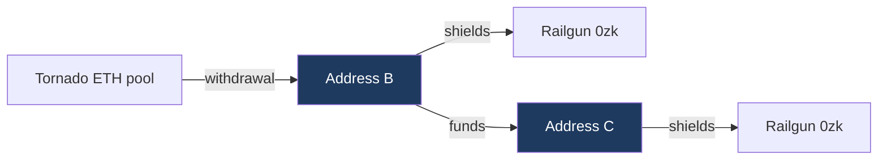

# Tornado Cash to Railgun

Measured connectivity between Tornado Cash withdrawal addresses and Railgun
shielding addresses, at depth zero and depth one, month by month. No time
window is applied at any stage.

Depth zero is the upper path, where one address both withdraws and shields.
Depth one is the lower path, with a transfer inserted between them. The two
sets are disjoint, so no shielder is counted twice.

## Headline

| | Shielders | Share of all shielders |
|---|---:|---:|
| Reached at depth 0 or 1 | 1,886 | 6.45% |
| Depth 0, same address on both sides | 384 | 1.31% |
| Depth 1, funded by a withdrawal address | 1,502 | 5.13% |
| All Railgun shielders | 29,256 | 100% |

## The designation is not visible in the data

99.5% of depth zero addresses and 99.2% of depth one addresses first shielded
after the OFAC designation of 8 August 2022. On its own that looks decisive.
It is not, because 99.8% of *all* Railgun shielders did the same.

| Population | First shielded before 8 Aug 2022 | Share | Difference from baseline |
|---|---:|---:|---:|
| All shielders | 57 of 29,256 | 0.195% | baseline |
| Depth 0 | 2 of 384 | 0.521% | +0.33 pp |
| Depth 1 | 12 of 1,502 | 0.799% | +0.60 pp |

Tornado linked shielders are marginally **more** likely to predate the
designation than the shielding population as a whole, not less. The direction
is the opposite of what a migration account predicts, though the absolute
numbers are small enough that the honest reading is no effect rather than a
reverse one.

Two further observations point the same way. August 2022, the designation
month, contained **zero** depth zero overlaps out of 66 new shielders. And
across the six months from the designation onward, the depth one share was
23.1%, against 21.1% in the months before it, a difference of two percentage
points on a base of 57 shielders.

## What does move: a steady decline

| Year | New shielders | Depth 0 | Share | Depth 1 | Share |
|---|---:|---:|---:|---:|---:|
| 2022 | 454 | 5 | 1.10% | 71 | 15.64% |
| 2023 | 2,863 | 75 | 2.62% | 355 | 12.40% |
| 2024 | 6,240 | 62 | 0.99% | 355 | 5.69% |
| 2025 | 11,078 | 142 | 1.28% | 493 | 4.45% |
| 2026 | 8,621 | 100 | 1.16% | 228 | 2.64% |

The depth one share falls almost sixfold, from 15.6% to 2.6%, monotonically
after 2022. Depth zero shows no trend at all, sitting between 1% and 2.6%
throughout.

That decline is the clearest signal in the dataset, and it runs in the
opposite direction to a designation driven migration. It is what you would
expect if Railgun's earliest users were drawn disproportionately from an
existing privacy tool population that overlapped with Tornado, and if later
growth diluted that population as the protocol reached a broader base. The
absolute counts rise while the share falls, which is why the counts alone are
misleading.

## Month by month

Read the share columns. Absolute counts track Railgun's own growth.

| Month | New shielders | Depth 0 | Share | Depth 1 | Share |
|---|---:|---:|---:|---:|---:|
| 2022-05 | 15 | 0 | 0.00% | 2 | 13.33% |
| 2022-06 | 23 | 0 | 0.00% | 6 | 26.09% |
| 2022-07 | 19 | 2 | 10.53% | 4 | 21.05% |
| **2022-08** | 66 | 0 | 0.00% | 20 | 30.30% |
| 2022-09 | 88 | 1 | 1.14% | 12 | 13.64% |
| 2022-10 | 61 | 0 | 0.00% | 10 | 16.39% |
| 2022-11 | 86 | 0 | 0.00% | 6 | 6.98% |
| 2022-12 | 96 | 2 | 2.08% | 11 | 11.46% |
| 2023-01 | 200 | 1 | 0.50% | 79 | 39.50% |
| 2023-02 | 155 | 5 | 3.23% | 10 | 6.45% |
| 2023-03 | 186 | 11 | 5.91% | 16 | 8.60% |
| 2023-04 | 253 | 10 | 3.95% | 25 | 9.88% |
| 2023-05 | 223 | 9 | 4.04% | 18 | 8.07% |
| 2023-06 | 259 | 5 | 1.93% | 43 | 16.60% |
| 2023-07 | 218 | 3 | 1.38% | 27 | 12.39% |
| 2023-08 | 253 | 8 | 3.16% | 25 | 9.88% |
| 2023-09 | 243 | 4 | 1.65% | 20 | 8.23% |
| 2023-10 | 282 | 6 | 2.13% | 28 | 9.93% |
| 2023-11 | 299 | 3 | 1.00% | 33 | 11.04% |
| 2023-12 | 292 | 10 | 3.42% | 31 | 10.62% |
| 2024-01 | 330 | 6 | 1.82% | 30 | 9.09% |
| 2024-02 | 252 | 2 | 0.79% | 23 | 9.13% |
| 2024-03 | 370 | 2 | 0.54% | 21 | 5.68% |
| 2024-04 | 408 | 2 | 0.49% | 21 | 5.15% |
| 2024-05 | 668 | 8 | 1.20% | 34 | 5.09% |
| 2024-06 | 626 | 14 | 2.24% | 46 | 7.35% |
| 2024-07 | 479 | 5 | 1.04% | 29 | 6.05% |
| 2024-08 | 706 | 6 | 0.85% | 33 | 4.67% |
| 2024-09 | 705 | 7 | 0.99% | 35 | 4.96% |
| 2024-10 | 606 | 3 | 0.50% | 22 | 3.63% |
| 2024-11 | 556 | 4 | 0.72% | 32 | 5.76% |
| 2024-12 | 534 | 3 | 0.56% | 29 | 5.43% |
| 2025-01 | 648 | 2 | 0.31% | 36 | 5.56% |
| 2025-02 | 604 | 1 | 0.17% | 21 | 3.48% |
| 2025-03 | 822 | 4 | 0.49% | 26 | 3.16% |
| 2025-04 | 867 | 18 | 2.08% | 29 | 3.34% |
| 2025-05 | 834 | 4 | 0.48% | 30 | 3.60% |
| 2025-06 | 787 | 4 | 0.51% | 38 | 4.83% |
| 2025-07 | 728 | 7 | 0.96% | 35 | 4.81% |
| 2025-08 | 1,166 | 6 | 0.51% | 38 | 3.26% |
| 2025-09 | 1,095 | 19 | 1.74% | 80 | 7.31% |
| 2025-10 | 1,118 | 14 | 1.25% | 51 | 4.56% |
| 2025-11 | 966 | 47 | 4.87% | 45 | 4.66% |
| 2025-12 | 1,443 | 16 | 1.11% | 64 | 4.44% |
| 2026-01 | 1,666 | 14 | 0.84% | 47 | 2.82% |
| 2026-02 | 978 | 4 | 0.41% | 27 | 2.76% |
| 2026-03 | 1,123 | 17 | 1.51% | 37 | 3.29% |
| 2026-04 | 943 | 2 | 0.21% | 25 | 2.65% |
| 2026-05 | 997 | 11 | 1.10% | 29 | 2.91% |
| 2026-06 | 1,075 | 28 | 2.60% | 34 | 3.16% |
| 2026-07 | 1,336 | 15 | 1.12% | 21 | 1.57% |
| 2026-08 | 503 | 9 | 1.79% | 8 | 1.59% |

August 2022, the designation month, is in bold.

Three months stand out against their neighbours and are worth inspecting
individually rather than treating as noise. January 2023 at 39.50% is the
highest depth one share in the series. November 2025 at 4.87% is the highest
depth zero share after 2023 and its 47 addresses are the single largest depth
zero month. September 2025 is elevated on both measures at once.

## Lag structure

This is the operationally informative part, and it is where the two depths
differ most.

**Depth 0, withdrawal to shield**

| | Count | Share |
|---|---:|---:|
| Negative, out of order | 16 | 4.2% |
| Same day | 207 | 53.9% |
| 1 to 7 days | 22 | 5.7% |
| 7 to 30 days | 16 | 4.2% |
| 30 to 90 days | 13 | 3.4% |
| 90 days to 1 year | 9 | 2.3% |
| Over a year | 101 | 26.3% |

Median 0 days, longest 2,287 days.

**Depth 1, three legs**

| | Withdrawal to funding | Funding to shield | End to end |
|---|---:|---:|---:|
| Negative, out of order | 165, 9.7% | 199, 11.7% | 59, 3.5% |
| Same day | 256, 15.0% | 1,024, 60.0% | 209, 12.2% |
| 1 to 7 days | 51, 3.0% | 48, 2.8% | 50, 2.9% |
| 7 to 30 days | 71, 4.2% | 26, 1.5% | 62, 3.6% |
| 30 to 90 days | 86, 5.0% | 28, 1.6% | 68, 4.0% |
| 90 days to 1 year | 247, 14.5% | 54, 3.2% | 195, 11.4% |
| Over a year | 831, 48.7% | 328, 19.2% | 1,064, 62.3% |
| **Median** | **334.3 days** | **0.0 days** | **668.9 days** |

The shape is consistent and specific. The withdrawal address holds funds for a
long time, a median of eleven months and nearly half for over a year, and then
the recipient shields the same day it is paid in 60% of cases. The hop itself
is immediate. All of the delay sits upstream of it.

That is a recognisable operational signature. An address funded and used
within a single day, for the single purpose of shielding, is behaving as a
purpose created intermediate rather than as an ordinary wallet that happened
to receive a payment. It supports reading these chains as deliberate, while
the long upstream delay argues against any of it being a reaction to a
specific event.

At depth zero the same immediacy appears directly, with 53.9% withdrawing and
shielding on the same day.

## Coverage and limits

| | |
|---|---:|
| Pool contracts observed paying | 28 of 48 filtered |
| Payouts collected | 498,710 |
| Distinct addresses paid | 124,181 |
| Withdrawal set after relayer exclusion | 123,981 |
| Railgun shielders | 29,256 |
| Shielders with at least one funding row | 29,237, 99.9% |
| Funding edges examined | 1,872,205 |

Source coverage:

| Dataset | Covers | Used by |
|---|---|---|
| `overlap.db` payouts | Dec 2019 to Aug 2026 | depth 0 and 1 |
| `railgun.db` shields | **May 2022** to Aug 2026 | depth 0 and 1 |
| `onehop.db` funding | Oct 2020 to Aug 2026 | depth 1 only |

**The series does not reach Railgun's launch.** Railgun deployed in December
2021 and the shielder extraction begins at block 14,751,290, which is May
2022. Roughly the first five months of the protocol are absent. The likely
cause is that Railgun sits behind an upgradeable proxy, so a V1 shield event
under a different topic would be invisible to a filter written for the V2
event, and 14,751,290 would be the upgrade block rather than a deployment.
Both timelines therefore start in May 2022 rather than December 2021, and only
57 shielders fall before the designation, which is 0.195% of the observation
window. Any before and after comparison rests on that narrow base.

The funding layer begins at block 11,000,330, October 2020, which is a sweep
boundary rather than a property of the data. A shielder funded before that
date would be missed at depth one.

The withdrawal set covers the ETH denominated pools only. Withdrawals from the
ERC-20 pools move DAI, USDC, USDT or WBTC rather than ETH and so produce no
value bearing trace. 28 of the 48 filtered contracts paid out at all, which is
consistent with that.

One range failed on a read timeout, blocks 21,896,000 to 21,896,999, being
0.006% of the swept range.

Relayers were separated from recipients by payout frequency, since a relayed
withdrawal pays both from the same pool. At the chosen cutoff of 100 payouts,
200 addresses were excluded. The result is stable across cutoffs from 25 to
1,000, moving by four addresses at depth zero and eight at depth one.

## What this establishes

A funding edge is not an identity claim. Two addresses joined by a payment may
or may not be controlled by the same person, and nothing on chain
distinguishes those cases.

The measured set is therefore neither an upper nor a lower bound on migration.
Not an upper bound, because anyone who inserted a second hop, used an
exchange, or bridged is absent. Not a lower bound, because some of what it
counts is incidental.

On the specific question of whether the designation drove users from Tornado
Cash to Railgun, the data does not support it. The post-designation
concentration is entirely explained by Railgun's own adoption curve, the
designation month itself contains no depth zero overlaps, the six months
following it are indistinguishable from the months before, and the depth one
share declines steadily thereafter rather than rising.

The connectivity that does exist is real and operationally distinctive, but it
looks like a persistent overlap between two privacy tool user bases, thinning
as Railgun grew, rather than a movement between them triggered by an
enforcement action.

The ratio between depths remains the more robust observation. Connectivity
grows roughly fourfold from depth zero to depth one, and the candidate set at
depth two is large enough that it cannot discriminate at all. That is a ceiling
on what public chain data can establish, not a gap that closes with a better
node or a longer sweep.

---

Generated from `analysis11.py`, `timeline11.py` and `timeline112.py`. Relayer
cutoff 100. Designation block 15,307,000.
