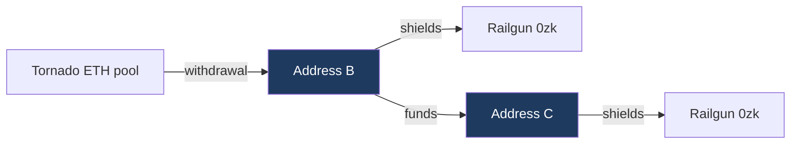

# Tornado Cash to Railgun

Measured connectivity between Tornado Cash withdrawal addresses and Railgun
shielding addresses. No time window is applied at any stage.

Two distinct questions are answered here. Whether the same address appears
on both sides, and whether a Tornado withdrawal address funded an address
that then shielded.

The upper path is depth zero, the same address withdrawing and shielding.
The lower path is depth one, with a transfer inserted between them.

## Headline

| | Shielders | Share of all shielders |
|---|---:|---:|
| Reached at depth 0 or 1 | 1,886 | 6.45% |
| Depth 0, same address on both sides | 384 | 1.31% |
| Depth 1, funded by a withdrawal address | 1,502 | 5.13% |
| All Railgun shielders | 29,256 | 100% |

Depth one is 3.9 times the size of depth zero. The direct pattern, in which
an address withdraws from a pool and shields from that same address without
an intervening transfer, is the minority case by a wide margin.

## Depth 0, overlapping addresses

An address present in both the withdrawal set and the shielding set.

| | Count |
|---|---:|
| Addresses in both sets | 384 |
| First shielded on or after 8 August 2022 | 382 |
| Withdrawal recorded after the shield | 16 |
| Consistent with the sequence | 368 |

The sixteen exclusions shielded before they ever withdrew from a pool, so
they cannot be an instance of withdrawing and then shielding. They are
reported rather than removed.

## Depth 1, one hop

A withdrawal address that funded a different address, where that address
then shielded. Shielders already counted at depth zero are excluded, so the
two categories do not overlap.

| | Count |
|---|---:|
| Withdrawal address to shielder pairs | 1,707 |
| Distinct shielders reached | 1,502 |
| Distinct withdrawal addresses involved | 1,007 |
| First shielded on or after 8 August 2022 | 1,488 |

Ordering, reported and not applied:

| | Count | Share of pairs |
|---|---:|---:|
| Funded after that shielder's first shield | 199 | 11.7% |
| Funded before the funder's own withdrawal | 165 | 9.7% |
| Failing at least one check | 364 | 21.3% |

A payment arriving after the shield cannot explain that shield. A payment
sent before the funder withdrew means the funder was not yet a Tornado exit
at the time. Neither is filtered out. Both carry their block numbers in
`depth1.csv` so the ordering can be inspected per row.

1,007 withdrawal addresses produce 1,707 pairs, so a withdrawal address that
funds a shielder typically funds more than one.

## Relayer separation

A relayed withdrawal pays twice out of the same pool, once to the recipient
and once to the relayer as its fee. Both are ETH transfers from the same
contract, and the sweep did not retain values, so the two are separated by
payout frequency instead. A recipient is paid once or a few times. A relayer
is paid thousands of times.

| Cutoff | Exits | Relayers |
|---:|---:|---:|
| 5 | 115,428 | 8,753 |
| 10 | 120,956 | 3,225 |
| 25 | 123,379 | 802 |
| 50 | 123,824 | 357 |
| **100** *(used)* | **123,981** | **200** |
| 250 | 124,077 | 104 |
| 1,000 | 124,130 | 51 |

The 200 addresses excluded at the chosen cutoff are 0.16% of those paid. The
eight heaviest alone received 68,333 payouts, 13.7% of all 498,710, which is
a measure of how concentrated relaying was.

| Address | Payouts received |
|---|---:|
| `0x4750bcfcc340aa4b31be7e71fa072716d28c29c5` | 12,059 |
| `0xbe4d1e137a24af091be80ae58d652279665e3a27` | 10,516 |
| `0xa0f0287683e820ff4211e67c03cf46a87431f4e1` | 9,568 |
| `0xd6187b4a0f51355a36764558d39b2c21ac12393d` | 8,130 |
| `0x20bb3095a4852f4c97d7a188e9f7183c85acfc49` | 7,309 |
| `0x5555555731006f71f121144534ca7c8799f66aa3` | 7,151 |
| `0x0a5b2bf3ccfb44c1d22f07eed9553ecba752d4ad` | 7,049 |
| `0x3a1d526d09b7e59fd88de4726f68a8246ddc2742` | 6,551 |

## Sensitivity to the relayer cutoff

| Cutoff | Depth 0 | Depth 1 |
|---:|---:|---:|
| 5 | 341 | 1,261 |
| 10 | 370 | 1,417 |
| 25 | 381 | 1,496 |
| 50 | 383 | 1,500 |
| **100** *(used)* | **384** | **1,502** |
| 250 | 385 | 1,504 |
| 1,000 | 385 | 1,504 |

Above a cutoff of 25 the result is flat, moving by four addresses at depth
zero and eight at depth one across a fortyfold change in the threshold. The
cutoff is not carrying the finding. Below 25 the numbers fall, which reflects
genuine repeat users being misclassified as relayers rather than any
instability in the method.

## Baseline

> To be completed by running `report11.py`, which computes both rows.

| Population | First shielded on or after 8 Aug 2022 | Share |
|---|---:|---:|
| All shielders | of 29,256 | |
| Tornado linked | 1,870 of 1,886 | 99.2% |

The linked figure looks decisive on its own and is not. Railgun's adoption is
itself concentrated after August 2022, so if the whole shielding population
is close to 99% post-designation, then Tornado linked shielders being 99%
post-designation carries no inference about migration at all. The gap between
the two rows, not the second row, is the quantity any argument would rest on.

## Coverage

| | |
|---|---:|
| Pool contracts observed paying | 28 |
| Payouts collected | 498,710 |
| Distinct addresses paid | 124,181 |
| Exit set after relayer exclusion | 123,981 |
| Blocks swept | 16,635,000 |
| Railgun shielders | 29,256 |
| Funding edges examined | 1,872,205 |

One range failed and was not collected, blocks 21,896,000 to 21,896,999, on
a read timeout. That is 0.006% of the swept range.

The exit set covers the ETH denominated pools only. Withdrawals from the
ERC-20 pools move DAI, USDC, USDT or WBTC rather than ETH and therefore
produce no value bearing trace, so they are absent by construction. 28 of the
48 filtered contracts paid out at all, which is consistent with that.

The independent cross check is that 124,181 addresses here sit within one
percent of 125,218 derived earlier from `Withdrawal` event logs, and 384
overlapping addresses sit within five of 373 from the same earlier route.

## What this establishes

A funding edge is not an identity claim. Two addresses joined by a payment
may or may not be controlled by the same person, and nothing on chain
distinguishes those cases.

The measured set is therefore neither an upper nor a lower bound on
migration. Not an upper bound, because anyone who inserted a second hop, used
an exchange, or bridged is absent from it. Not a lower bound, because some of
what it counts is incidental rather than one actor moving between protocols.

The ratio between depths is the more robust observation. Connectivity grows
roughly fourfold from depth zero to depth one, and the candidate set at depth
two is large enough that it cannot discriminate at all. That is a ceiling on
what public chain data can establish, not a gap that closes with a better
node or a longer sweep.
